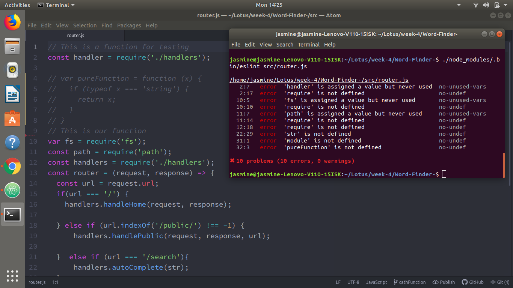

# Linting
--------

# 1. Research what linting is and why it is very useful? What is es-lint?  

#### JavaScript lint checks all the javascript code with common mistakes with running it in the terminal or in the browser.
#### Also, it's not just about checking the syntax, it examines the coding techniques used in the script and warn against questionable practices.
#### 1- Here are some common mistakes that JavaScript Lint looks for:
#### - Missing semicolons at the end of a line.
#### - Curly braces without an if, for, while, etc.
#### - Code that is never run because of a return, throw, continue, or break.
#### - Case statements in a switch that do not have a break statement.
#### - Leading and trailing decimal points on a number.
#### - A leading zero that turns a number into octal (base 8).
#### - Comments within comments.
#### - Ambiguity whether two adjacent lines are part of the same statement.
#### - Statements that don't do anything.    

#### 2- JavaScript Lint also looks for the following less common mistakes:
#### - Regular expressions that are not preceded by a left parenthesis, assignment, colon, or comma.
#### - Statements that are separated by commas instead of semicolons.
#### - Use of increment (++) and decrement (--) except for simple statements such as "i++;" or "--i;".
#### - Use of the void type.
#### - Successive plus (e.g. x+++y) or minus (e.g. x---y) signs.
#### - Use of labeled for and while loops.
#### - if, for, while, etc. without curly braces. (This check is disabled by default.)    
#### ESLint is an open source JavaScript linting utility originally created by Nicholas C. Zakas in June 2013. Code linting is a type of static analysis that is frequently used to find problematic patterns or code that doesn’t adhere to certain style guidelines. There are code linters for most programming languages, and compilers sometimes incorporate linting into the compilation process.


# 2. Install es-lint in an old project of yours following their getting started guide


# 3. What are some of the commands you can use with es-lint? How do you configure it (style guide vs. your own configuration)?
#### To run ESLint on Node.js, you must have npm installed. If npm is not installed, follow the instructions [here]( https://www.npmjs.com/).
#### The command line utility has several options:

```eslint [options] file.js [file.js] [dir] ```
```
Basic configuration:
  --no-eslintrc                  Disable use of configuration from .eslintrc.*
  -c, --config path::String      Use this configuration, overriding .eslintrc.* config options if present
  --env [String]                 Specify environments
  --ext [String]                 Specify JavaScript file extensions - default: .js
  --global [String]              Define global variables
  --parser String                Specify the parser to be used
  --parser-options Object        Specify parser options

Specifying rules and plugins:
  --rulesdir [path::String]      Use additional rules from this directory
  --plugin [String]              Specify plugins
  --rule Object                  Specify rules

Fixing problems:
  --fix                          Automatically fix problems
  --fix-dry-run                  Automatically fix problems without saving the changes to the file system
  --fix-type Array               Specify the types of fixes to apply (problem, suggestion, layout)

Ignoring files:
  --ignore-path path::String     Specify path of ignore file
  --no-ignore                    Disable use of ignore files and patterns
  --ignore-pattern [String]      Pattern of files to ignore (in addition to those in .eslintignore)

Using stdin:
  --stdin                        Lint code provided on <STDIN> - default: false
  --stdin-filename String        Specify filename to process STDIN as

Handling warnings:
  --quiet                        Report errors only - default: false
  --max-warnings Int             Number of warnings to trigger nonzero exit code - default: -1

Output:
  -o, --output-file path::String  Specify file to write report to
  -f, --format String            Use a specific output format - default: stylish
  --color, --no-color            Force enabling/disabling of color

Inline configuration comments:
  --no-inline-config             Prevent comments from changing config or rules
  --report-unused-disable-directives  Adds reported errors for unused eslint-disable directives

Caching:
  --cache                        Only check changed files - default: false
  --cache-file path::String      Path to the cache file. Deprecated: use --cache-location - default: .eslintcache
  --cache-location path::String  Path to the cache file or directory

Miscellaneous:
  --init                         Run config initialization wizard - default: false
  --debug                        Output debugging information
  -h, --help                     Show help
  -v, --version                  Output the version number
  --print-config path::String    Print the configuration for the given file
```

#### Basic configuration:  
* ``` --no-eslintrc```

* ```eslint --no-eslintrc file.js```

* ```-c, --config```
* ```eslint -c ~/my-eslint.json file.js```

*  ```--env```
* ```eslint --env browser,node file.js
eslint --env browser --env node file.js
```


# 4. How do you disable eslint on single lines and in files? Explain why you shouldn't disable eslint rules in most cases.

* ### When Not To Use It
#### If you have a large code base that was not developed with a policy to not use such warning terms, you might get hundreds of warnings / errors which might be contra-productive if you can’t fix all of them (e.g. if you don’t get the time to do it) as you might overlook other warnings / errors or get used to many of them and don’t pay attention on it anymore.
#### Same reason as the point above: You shouldn’t configure terms that are used very often (e.g. central parts of the native language used in your comments).


# 5. How can you set up your editor to show you the linting issues?
#### Installation and Usage
[Prerequisites: Node.js (^8.10.0, ^10.13.0, or >=11.10.1), npm version 3+.]

#### You can install ESLint using npm:
```
$ npm install eslint --save-dev
```
#### You should then set up a configuration file:

```
$ ./node_modules/.bin/eslint --init
```
#### After that, you can run ESLint on any file or directory like this:
```
$ ./node_modules/.bin/eslint yourfile.js
```

# 6. How can you ignore a line or a file in es-lint

### This rule makes you specify the rules you want to disable when using eslint-disable, eslint-disable-line or eslint-disable-next-line comments.

### If you want to disable an ESLint rule in a file or on a specific line, you can add a comment.

### On a single line:

```
const message = 'foo';
console.log(message); // eslint-disable-line no-console

// eslint-disable-next-line no-console
console.log(message);
```
### On the whole (rest of the) file:
```
/* eslint-disable no-console */
const message = 'foo';
console.log(message);
```
